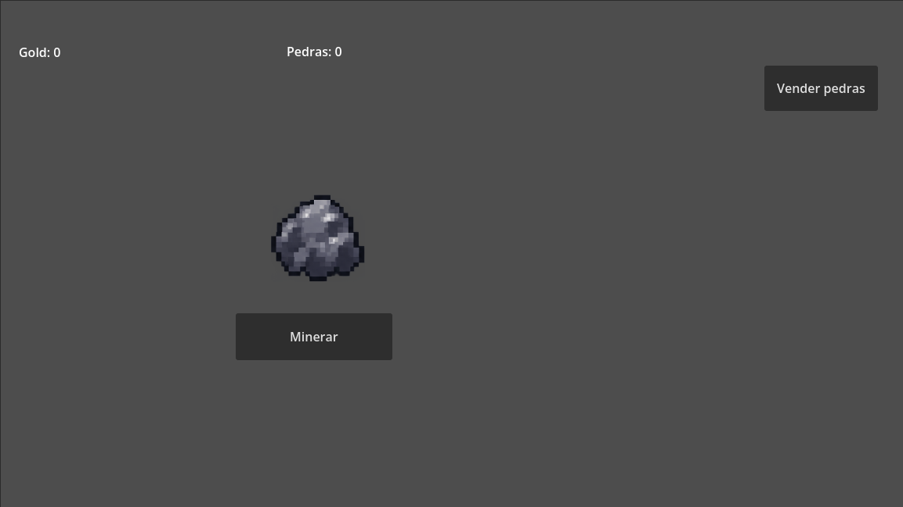
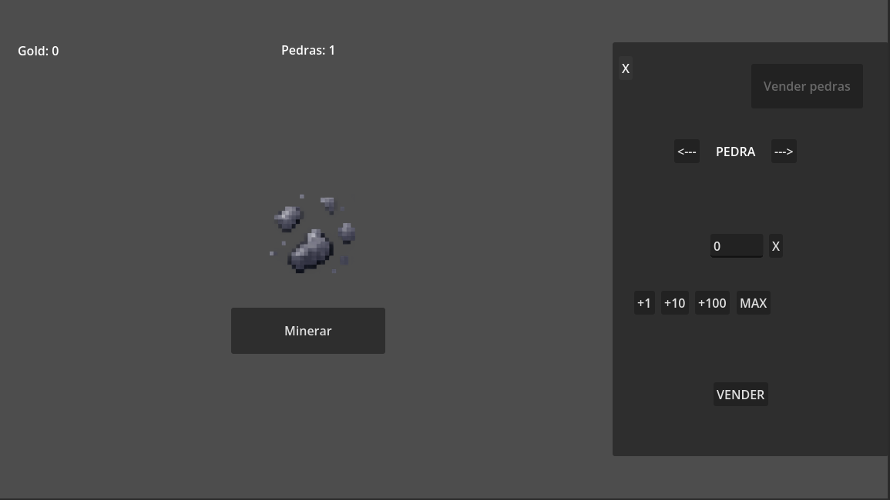

# ⛏️ Ultra Mining

**Ultra Mining** é um jogo incremental de mineração desenvolvido em **Godot**, atualmente em fase de protótipo.

Este projeto também registra minha evolução no aprendizado de desenvolvimento de jogos, desde as primeiras mecânicas até versões mais completas do jogo.

## 🎮 Sobre o jogo

A ideia de Ultra Mining é começar pequeno e evoluir cada vez mais.

O jogador começa minerando pedras e coletando recursos, que podem ser vendidos para conseguir Gold e futuramente adquirir melhorias.

A progressão pretende aumentar gradualmente a escala da mineração, passando de pequenas pedras para estruturas cada vez maiores.

### 🔁 Core Loop

**Minerar → Quebrar → Coletar materiais → Vender → Ganhar Gold → Melhorar → Minerar mais**

---

## 🚧 Estado atual

O projeto está atualmente na fase de **protótipo**.

### Implementado

- Sistema básico de mineração
- Vida da pedra
- Diferentes estados visuais de dano
- Quebra e reaparecimento da pedra
- Coleta de pedras
- Contador de materiais
- Sistema inicial de Gold
- Abertura e fechamento do menu de venda

### Em desenvolvimento

- Seleção de materiais no menu de venda
- Seleção da quantidade a ser vendida
- Venda de quantidades específicas
- Suporte a múltiplos materiais

---

## 📸 Protótipo atual

### Mineração

### Menu de venda

> As interfaces e artes atuais são provisórias e serão substituídas conforme o desenvolvimento avançar.

---

## 🛠️ Tecnologias

- Godot Engine
- GDScript
- Git
- GitHub

---

## 📈 Desenvolvimento

O projeto está sendo desenvolvido de forma incremental. Novas mecânicas, sistemas e melhorias serão registradas através do histórico de commits do repositório.